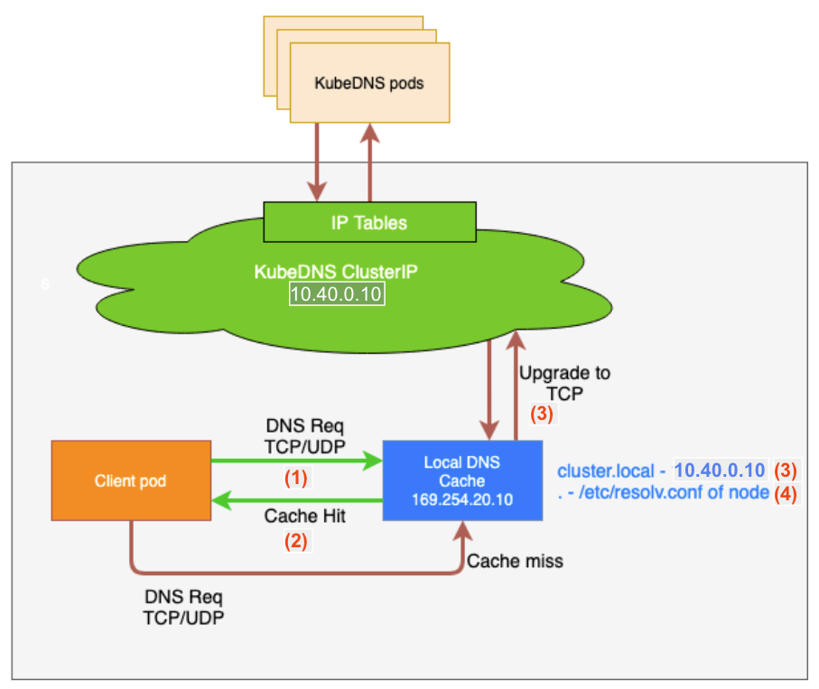

# NodeLocalDnsCache

## Context

NodeLocalDnsCache is a feature introduced in Kubernetes 1.18 which is aiming to improve DNS lookup latency, and fix issues with default Kubernetes DNS implementation :  

* Internal DNS overloading
* conntrack issues (see [DNS intermittent delays of 5s issue](https://github.com/kubernetes/kubernetes/issues/56903) and [racy conntrack and dns lookup timeouts](https://www.weave.works/blog/racy-conntrack-and-dns-lookup-timeouts))


See more details in the [official Kubernetes Documentation](https://kubernetes.io/docs/tasks/administer-cluster/nodelocaldns/) and in [this article](https://povilasv.me/kubernetes-node-local-dns-cache)

## How it works

NodeLocalDns acts as a small dns cache deployed as a DaemonSet to all nodes of a cluster.
When a Pod makes a DNS request, the request goes to the DNS cache running on the same node as the Pod. If the cache can't resolve the DNS request, the cache forwards the request to:

* DNS servers configured in /etc/resolv.conf on the local node for external hostname queries.  
* kube-dns for all other DNS queries. The kube-dns-upstream service is used by node-local-dns Pods to reach out to kube-dns Pods.

Pods do not need to be modified to use NodeLocal DNSCache.  
NodeLocal DNSCache consumes compute resources and requests 0,025 vCPU on each node of the cluster.



|  | Description  |
|---|---|
| **(1)** | Pods deployed in a cluster are by default configured to send DNS requests to kube-dns using its Service IP (10.40.0.10 in SocGen clusters). NodeLocalDnsCache adds a network interface and somme iptables rules on all worker nodes that intercept traffic and send it to the local dns cache.  |
| **(2)** | DNS record in the local dns cache (default TTL = 5s) is directly returned to the requesting Pod |
| **(3)** | If the DNS record is not in the local dns cache and the request is in cluster.local scope (default for Service declared in Kubernetes clusters), it is sent to kube-dns using TCP to avoid conntrack issue |
| **(4)** | Else the request is forwarded to the dns servers configured locally on the host in /etc/resolv.conf |

## Deployment

Follow the steps below to deploy NodeLocalDnsCache on a cluster

* Source a client bundle

```sh
cd <bundle dir>
source env.sh
```

* Adjust the template for the current cluster

```sh
export localdns=169.254.20.10
export domain=cluster.local
# Get current kube-dns Service IP
export kubedns=$(kubectl get svc kube-dns -n kube-system -o jsonpath={.spec.clusterIP})

sed "s/__PILLAR__LOCAL__DNS__/$localdns/g; s/__PILLAR__DNS__DOMAIN__/$domain/g; s/__PILLAR__DNS__SERVER__/$kubedns/g" nodelocaldnscache.yaml.template > nodelocaldnscache.yaml
```

> **INFO**  
> NodeLocalDnsCache use a link-local IP address to bind the local dns daemon. It's configured by default to use ```169.254.20.10``` but can be adjusted to any free link-local IP

> **INFO**  
> It's important to get kube-dns Service IP before a deployment on a cluster, because it can be different on each cluster.  
> ClusterIP CIDR was changed from default 10.96.0.0/16 to 10.40.0.0/16 on SocGen clusters.

* Deploy NodeLocalDnsCache

```sh
kubectl apply -f nodelocaldnscache.yaml
```

* After a couple of seconds, each NodeLocalDnsCache Pod will create a network interface and add iptables rules to intercept traffic intended for kube-dns.

```sh
ip addr show nodelocaldns
208: nodelocaldns: <BROADCAST,NOARP> mtu 1500 qdisc noop state DOWN group default
    link/ether 36:38:6b:6d:7b:82 brd ff:ff:ff:ff:ff:ff
    inet 169.254.20.10/32 brd 169.254.20.10 scope global nodelocaldns
       valid_lft forever preferred_lft forever
    inet 10.40.0.10/32 brd 10.96.0.10 scope global nodelocaldns
       valid_lft forever preferred_lft forever
```

```sh
iptables-save | egrep 169.254.20.10
-A PREROUTING -d 169.254.20.10/32 -p udp -m udp --dport 53 -j NOTRACK
-A PREROUTING -d 169.254.20.10/32 -p tcp -m tcp --dport 53 -j NOTRACK
-A OUTPUT -s 169.254.20.10/32 -p tcp -m tcp --sport 8080 -j NOTRACK
[...]
```

## Testing

Connect to a worker node, and check that the localdnscache is taking traffic

```sh
curl http://localhost:9253/metrics 2>/dev/null | egrep "^coredns_cache_hits_total"
coredns_cache_hits_total{server="dns://10.40.0.10:53",type="success"} 65
```

Wait some time and get metrics again, the counter ```coredns_cache_hits_total``` should increase

## Possible impacts

* Previously, all DNS requests went to kube-dns Pods who are on Manager nodes.  
If the request was for a record outside of the cluster (xxx.fr.world.socgen, or azure fqdn for example), it forwarded to DNS servers configured in /etc/resolv.conf on managers.  
These kind of requests will now use DNS servers configured in /etc/resolv.conf on each node where the Pod doing the request is located.  
Actually it could be an improvement from current architecture because it would add the possibility to configure different DNS servers depending on the node collection (network zone)

* 2/ If nodelocaldnscache Pod fails on a node, every DNS requests will fail. The Pod has a liveness probe to restart the container if there's any problem.  

## Rollback

* To rollback, just delete the DaemonSet.  
```sh
kubectl delete -f nodelocaldnscache.yaml
```

NodeLocalDnsCache will automatically delete the network interface and remove iptables rules
In case of a problem when removing the iptables rules, just reboot the node.